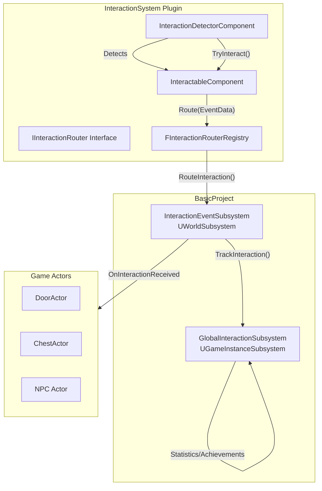

# Interaction Event System
# 인터랙션 이벤트 시스템

A comprehensive guide to the Interaction Event System architecture, explaining how events flow between plugins and the main project.

인터랙션 이벤트 시스템의 아키텍처 전체 가이드로, 플러그인과 메인 프로젝트 간의 이벤트 흐름을 설명합니다.

---

## 📋 Overview | 개요

The Interaction System is a **modular**, **decoupled** event-driven system designed for handling player-world interactions. It uses interface-based routing to avoid circular dependencies between plugins and the main project.

인터랙션 시스템은 **모듈화**되고 **디커플링**된 이벤트 기반 시스템으로, 플레이어와 월드 간의 상호작용을 처리하도록 설계되었습니다. 플러그인과 메인 프로젝트 간의 순환 의존성을 피하기 위해 인터페이스 기반 라우팅을 사용합니다.

---

## 🏗️ Architecture | 아키텍처



---

## 📦 Core Components | 핵심 컴포넌트

### 1. InteractableComponent

Makes any actor interactable. Attach this component to enable interaction functionality.

아무 액터에나 상호작용 기능을 부여합니다. 이 컴포넌트를 부착하면 상호작용이 가능해집니다.

| Property | Type | Description |
|----------|------|-------------|
| `InteractionType` | `FName` | Identifier for categorizing interactions (e.g., "Door", "Item", "NPC") |
| `DisplayText` | `FText` | UI display text shown in the interaction widget |
| `bHandleLocally` | `bool` | If true, uses local delegate instead of routing (DEBUG ONLY) |
| `bCanInteract` | `bool` | Enable/disable interaction |
| `MarkerOffset` | `FVector` | Widget position offset relative to actor |

**Key Functions:**

```cpp
// Attempt interaction with this component
void TryInteract(AActor* InteractionInstigator);

// Enable/disable interaction
void SetCanInteract(bool bNewCanInteract);

// Visibility state management
void SetVisible(bool bNewVisible);
void SetInteractable(bool bNewInteractable);
```

---

### 2. InteractionDetectorComponent

Detects nearby interactable objects. Attach to the player character.

주변의 상호작용 가능한 오브젝트를 탐지합니다. 플레이어 캐릭터에 부착하세요.

| Property | Type | Description |
|----------|------|-------------|
| `VisibilityRadius` | `float` | Radius where markers become visible (cm) |
| `InteractionRadius` | `float` | Radius where interaction is possible (cm) |
| `DetectionInterval` | `float` | How often to scan (0 = every tick) |
| `bDrawDebug` | `bool` | Draw debug visualization |

**Key Functions:**

```cpp
// Interact with current target
void TryInteract();

// Get current target
UInteractableComponent* GetCurrentTarget() const;

// Check if valid target exists
bool HasValidTarget() const;
```

---

### 3. IInteractionRouter Interface

Interface that decouples the plugin from the main project. The main project implements this to receive events.

플러그인을 메인 프로젝트로부터 분리하는 인터페이스. 메인 프로젝트가 이를 구현하여 이벤트를 수신합니다.

```cpp
class IInteractionRouter {
public:
    virtual void RouteInteraction(FInteractionEventData& EventData) = 0;
};
```

---

### 4. InteractionEventSubsystem (WorldSubsystem)

Routes interaction events within a specific world/level. Implements `IInteractionRouter`.

특정 월드/레벨 내에서 인터랙션 이벤트를 라우팅합니다. `IInteractionRouter`를 구현합니다.

**Features:**
- Registers as the global router on initialization
- Broadcasts `OnInteractionReceived` delegate
- Tracks world-specific interaction count

---

### 5. GlobalInteractionSubsystem (GameInstanceSubsystem)

Tracks interactions globally across all levels. Persists across level transitions.

모든 레벨에 걸쳐 전역적으로 인터랙션을 추적합니다. 레벨 전환에도 유지됩니다.

**Features:**
- Tracks total interaction count
- Tracks interaction count by type
- Useful for achievements and analytics

---

## 🔄 Event Flow | 이벤트 흐름

```mermaid
sequenceDiagram
    participant Player as Player Character
    participant IDC as InteractionDetectorComponent
    participant IC as InteractableComponent
    participant RR as RouterRegistry
    participant IES as InteractionEventSubsystem
    participant GIS as GlobalInteractionSubsystem
    participant Actor as Target Actor

    Player->>IDC: Input Action (E Key)
    IDC->>IDC: HasValidTarget()?
    IDC->>IC: TryInteract(Instigator)
    IC->>IC: BuildEventData()
    
    alt bHandleLocally = true
        IC->>IC: OnInteractLocal.Broadcast()
    else bHandleLocally = false
        IC->>RR: Route(EventData)
        RR->>IES: RouteInteraction()
        IES->>IES: OnInteractionReceived.Broadcast()
        IES->>GIS: TrackInteraction()
        IES-->>Actor: Handle Event
    end
```

---

## 💡 Usage Examples | 사용 예시

### Setting Up an Interactable Actor

```cpp
// In your actor's constructor or BeginPlay
UPROPERTY(VisibleAnywhere)
UInteractableComponent* InteractableComp;

// Constructor
InteractableComp = CreateDefaultSubobject<UInteractableComponent>(TEXT("Interactable"));
InteractableComp->InteractionType = TEXT("Door");
InteractableComp->DisplayText = NSLOCTEXT("Game", "OpenDoor", "Open Door");
```

### Listening for Interaction Events (Blueprint)

1. Get `InteractionEventSubsystem` from World
2. Bind to `OnInteractionReceived` delegate
3. Filter by `InteractionType` in your handler

### Listening for Interaction Events (C++)

```cpp
void AMyActor::BeginPlay()
{
    Super::BeginPlay();
    
    if (UWorld* World = GetWorld())
    {
        if (UInteractionEventSubsystem* Subsystem = 
            World->GetSubsystem<UInteractionEventSubsystem>())
        {
            Subsystem->OnInteractionReceived.AddDynamic(
                this, &AMyActor::HandleInteraction);
        }
    }
}

void AMyActor::HandleInteraction(FInteractionEventData& EventData)
{
    if (EventData.InteractionType == TEXT("Door") && 
        EventData.TargetActor == this)
    {
        ToggleDoor();
        EventData.bHandled = true;
    }
}
```

---

## 📊 FInteractionEventData Structure | 이벤트 데이터 구조체

| Field | Type | Description |
|-------|------|-------------|
| `Instigator` | `AActor*` | The actor that initiated the interaction (usually player) |
| `TargetActor` | `AActor*` | The actor being interacted with |
| `TargetComponent` | `UInteractableComponent*` | The interactable component |
| `InteractionType` | `FName` | Type identifier for filtering |
| `DisplayText` | `FText` | Text shown in UI |
| `bHandled` | `bool` | Set to true to stop event propagation |

---

## 🔧 Best Practices | 모범 사례

1. **Use InteractionType for Filtering**  
   Always check `InteractionType` before handling events to ensure you're responding to the correct interaction type.
   
   이벤트를 처리하기 전에 항상 `InteractionType`을 확인하여 올바른 상호작용 유형에 응답하는지 확인하세요.

2. **Set bHandled = true**  
   When you successfully handle an event, set `bHandled` to prevent other systems from processing it.
   
   이벤트를 성공적으로 처리하면 `bHandled`를 설정하여 다른 시스템이 처리하지 않도록 하세요.

3. **Avoid bHandleLocally in Production**  
   `bHandleLocally` is intended for debugging. Use the subsystem routing for production code.
   
   `bHandleLocally`는 디버깅용입니다. 프로덕션 코드에서는 서브시스템 라우팅을 사용하세요.

4. **Use GlobalInteractionSubsystem for Statistics**  
   Track achievements, analytics, and progression through the global subsystem.
   
   업적, 분석, 진행 상황 추적에는 글로벌 서브시스템을 사용하세요.

---

## 📁 File Structure | 파일 구조

```
BasicProject/
├── Plugins/
│   └── InteractionSystem/
│       └── Source/InteractionSystem/
│           ├── Public/
│           │   ├── InteractableComponent.h
│           │   ├── InteractionDetectorComponent.h
│           │   ├── InteractionRouter.h
│           │   ├── InteractionTypes.h
│           │   └── InteractionWidget.h
│           └── Private/
│               └── *.cpp
└── Source/BasicProject/
    └── Subsystems/
        ├── InteractionEventSubsystem.h/.cpp
        └── GlobalInteractionSubsystem.h/.cpp
```

---

## 🔗 Related Documentation | 관련 문서

- [Unreal Engine Subsystems](https://docs.unrealengine.com/5.0/en-US/programming-subsystems/)
- [Delegates in Unreal Engine](https://docs.unrealengine.com/5.0/en-US/delegates-and-lamba-functions-in-unreal-engine/)
