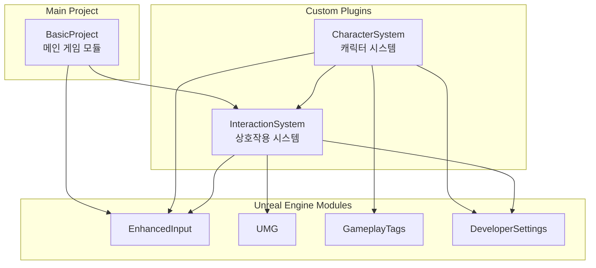
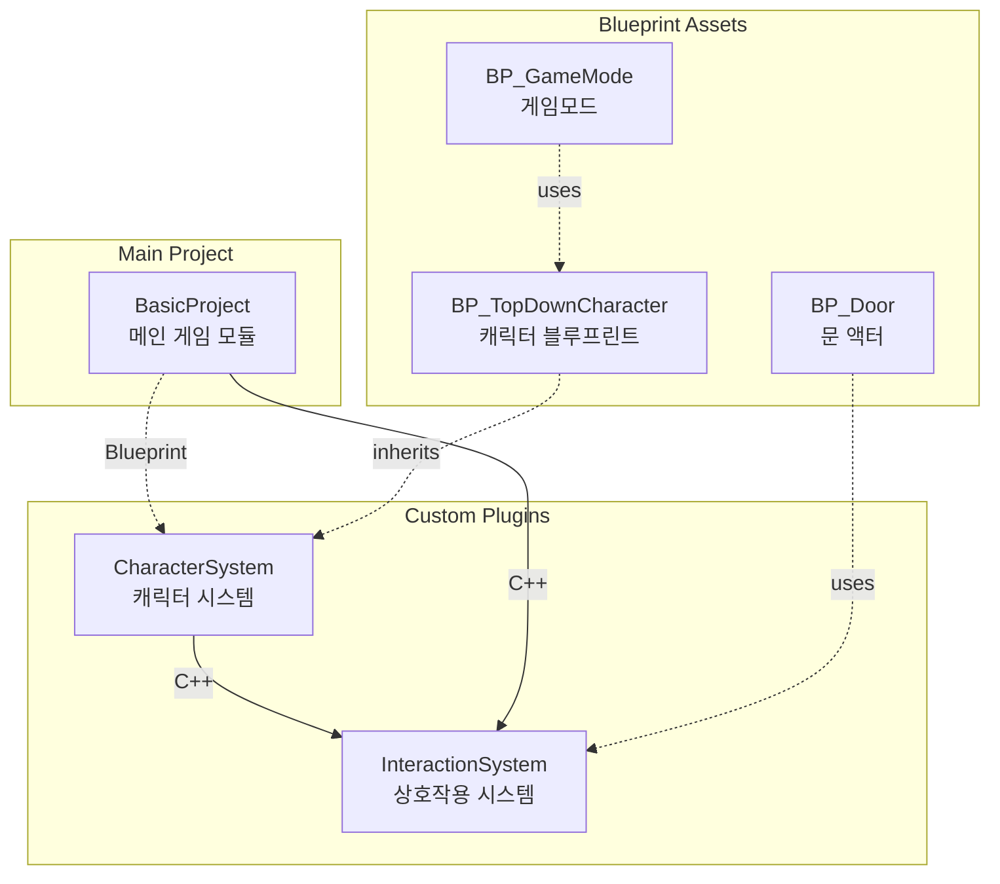

# UE5 Fundamentals - BasicProject
# UE5 기초 - BasicProject

A project for learning fundamental concepts of Unreal Engine 5.  
언리얼 엔진 5의 기초 개념을 학습하기 위한 프로젝트입니다.

---

## 📋 Overview | 개요

This project covers the basic fundamentals of Unreal Engine 5, intended as a learning resource for developers who are new to UE5 or want to refresh their understanding of core concepts.

이 프로젝트는 언리얼 엔진 5의 기본적인 내용을 다루며, UE5를 처음 접하거나 핵심 개념을 복습하고자 하는 개발자를 위한 학습 자료입니다.

---

## 🛠️ Development Environment | 개발 환경

| Category | Details |
|----------|---------|
| **Engine** | Unreal Engine 5.7.1 |
| **AI Tool** | Antigravity - Claude Opus 4.5 |
| **Platform** | Windows |

---

## 📚 Topics Covered | 다루는 주제

- **Inter-Plugin Event Communication** | 플러그인 간 이벤트 전달 방식
  - [Interaction Event System](BasicProject/Docs/InteractionEventSystem.md) | 인터랙션 이벤트 시스템

---

## 🔗 Plugin Dependency Graph | 플러그인 의존성 그래프

### Compile-Time Dependencies (Build.cs) | 컴파일 타임 의존성

C++ 코드에서 `#include`나 클래스 참조가 있을 때 필요한 의존성입니다.

| Module | Dependencies | Description |
|--------|--------------|-------------|
| **InteractionSystem** | EnhancedInput, UMG, DeveloperSettings | Core interaction detection and event routing |
| **CharacterSystem** | EnhancedInput, GameplayTags, InteractionSystem | Top-down character with input and camera |
| **BasicProject** | EnhancedInput, InteractionSystem | Main game module with subsystems |

---

### Runtime Dependencies (Blueprint/Reflection) | 런타임 의존성

블루프린트 상속, 레벨 배치, GameMode 설정 등 리플렉션 시스템을 통한 의존성입니다.  
Build.cs에 명시할 필요 없이 플러그인 활성화만으로 사용 가능합니다.

| Relationship | Type | Description |
|-------------|------|-------------|
| BasicProject → CharacterSystem | **Runtime** | BP_TopDownCharacter를 GameMode에서 사용 |
| BP_TopDownCharacter → CharacterSystem | **Runtime** | C++ 클래스를 블루프린트에서 상속 |
| BP_Door → InteractionSystem | **Runtime** | InteractableComponent를 블루프린트에서 추가 |

> **Legend | 범례:**  
> `───▶` Compile-time dependency (Build.cs 필요)  
> `- - -▶` Runtime dependency (블루프린트/리플렉션, Build.cs 불필요)

---

## 🚀 Getting Started | 시작하기

1. Clone this repository | 이 저장소를 클론합니다
2. Open `BasicProject/BasicProject.uproject` with Unreal Engine 5.7.1  
   Unreal Engine 5.7.1로 `BasicProject/BasicProject.uproject`를 엽니다
3. Build and run the project | 프로젝트를 빌드하고 실행합니다

---

## 🤖 AI-Assisted Development | AI 지원 개발

This project is developed with the assistance of **Antigravity - Claude Opus 4.5**.  
Antigravity is an AI coding assistant that helps with code generation, debugging, and documentation.

이 프로젝트는 **Antigravity - Claude Opus 4.5**의 지원을 받아 개발되었습니다.  
Antigravity는 코드 생성, 디버깅 및 문서화를 돕는 AI 코딩 어시스턴트입니다.

---

## 📄 License | 라이선스

This project is for educational purposes.  
이 프로젝트는 교육 목적으로 제작되었습니다.
